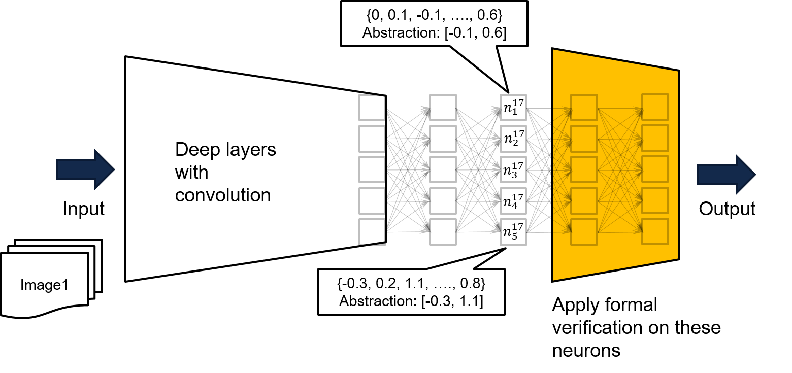

# nn-dependability-kit

nn-dependability-kit is an open source research tool to assist engineering neural networks for safety-critical domains. 

> C.-H. Cheng, C.-H. Huang, and G. Nührenberg. *nn-dependability-kit: Engineering Neural Networks for Safety-Critical Systems*.
https://arxiv.org/abs/1811.06746

## License

GNU Affero General Public License (AGPL) Version 3

## Manual

See [nn_dependability_kit_manual.pdf](https://github.com/dependable-ai/nn-dependability-kit/blob/master/nn_dependability_kit_manual.pdf)

## Try the tool

Examples are presented as jupyter notebooks to allow step-by-step understanding over the concepts. 

- [Metrics & test case generation] GTSRB_Neuron2ProjectionCoverage_TestGen.ipynb, or GTSRB_AdditionalMetrics.ipynb, or KITTI_Scenario_Coverage.ipynb, or MNIST_Neuron2ProjectionCoverage_TestGen.ipynb, or SSD_InterpretationPrecision.ipynb
- [Formal verification] TargetVehicleProcessingNetwork_FormalVerification.ipynb
- [Runtime verification] GTSRB_RuntimeMonitoring.ipynb, or MNIST_RuntimeMonitoring.ipynb  

## Structure

There are four packages under nndependability, namely
- basic: reader for models as well as intermediate representation of nn (for verification purposes)
- metrics: compute dependability metrics for neural networks
- atg: automatic test case generation to improve the metrics
- formal: formal verification (static analysis, constraint solving) of neural networks
- rv: runtime monitoring of neural networks

## Important python packages as requirements

- PyTorch + Numpy + matplotlib + jupyter
- [Test case generation] [Google optimization research tools](https://developers.google.com/optimization/introduction/installing/binary)
- [Verification / static analysis] PuLP (python-based MILP connector to CBC and other solvers)
    - [For Ubuntu users] CBC solver pre-shipped with PuLP may crash in solving some problems. Therefore, please additionally install [GNU GLPK](http://www.gnu.org/software/glpk/). The static analysis engine assumes that the GLPK solver is installed in the default directory "/usr/local/bin/glpsol". Whenever CBC crashes, GLPK is automatically triggered as a replacement. Unfortunately, this can't guarantee that both two solvers won't crash at the same time. Therefore, for industrial usage we strongly advise to use IBM CPLEX as the underlying MILP solver. 
- [Run-time verification] dd (binary decision diagram implemented using python)

## Related publications

- [Metrics & test case generation] https://arxiv.org/abs/1806.02338
- [Formal verification] https://arxiv.org/abs/1705.01040, https://arxiv.org/abs/1904.04706
- [Runtime verification] https://arxiv.org/abs/1809.06573
- [SSD-example] The example uses a few pictures from the VOC2012 dataset: The PASCAL Visual Object Classes (VOC) Challenge
Everingham, M., Van Gool, L., Williams, C. K. I., Winn, J. and Zisserman, A.
International Journal of Computer Vision, 88(2), 303-338, 2010

## Other topics
### A. Metrics related to intrepretation precision and occlusion sensitivity

#### 1. Additional package to be installed
- [Metrics] saliency (https://github.com/PAIR-code/saliency)
  Use it in the following way:
```
# init submodule for saliency
cd nndependability/metrics/saliency-source/
git submodule init
git submodule update
cd ..
ln -s saliency-source/saliency saliency
cd ../../
```

#### 2. Preparation for SSD example
```
cd models/SSD-Tensorflow/
git submodule init
git submodule update

# prepare weights
cd checkpoints/
unzip ssd_300_vgg.ckpt.zip
cd ../

# install custom changes to module SSD-Tensorflow that allows using saliency
git apply ../ssd_tensorflow_diff.diff
cd ../../
```
### B. Challenges in formal verification due to lack of input specification and scalability

To do formal verification over neural networks, there are two commonly seen problems.
* The scalability of formal verification may not be able to handle very complex and very deep networks
* The "shape of the input" is unknown. Indeed one commonly normalizes the data so every input is commonly having a range of [-1,1], but we may wish to have a tighter "over-approximation" over the training data. 

In nn-dependability-kit, we advise users to proceed with following steps.
* Perform analysis by taking a **subnetwork of close-to-output layers** like the yellow network of the below figure. If for every input to the yellow network, one guarantees that bad output will not be produced, then for every input to the original very deep & complex network, no bad output will be produced. 
    - The 2nd and 3rd parameters in function loadMlpFromPytorch() in nndependability/basics/pytorchreader.py support such a concept



* As inputs to the complete network may only lead to certain values for the input of the yellow network, if the safety property cannot be proven on the yellow network, our further recommendation is to **feed the complete network with training data, in order to derive a tighter over-approximation based on visited inputs** for the yellow network. An example can be found in neuron n^17_{1}, where by running the network with all available training data, we know that the training data makes the output of n^17_{1} bounded by [-0.1, 0.6]. We can thus use the recorded bound as input constraints for the yellow network to perform formal verification. 
    - Apart from using intervals, one can also record octagon constraints or even neuron activation patterns to create tighter over-appeximation of the visited data.

* The correctness of the verification is based on an assumption that it is impossible to have neuron values sitting outside the created interval, which is an **assume-guarantee** proof. The assumption can be easily monitored in runtime. 
